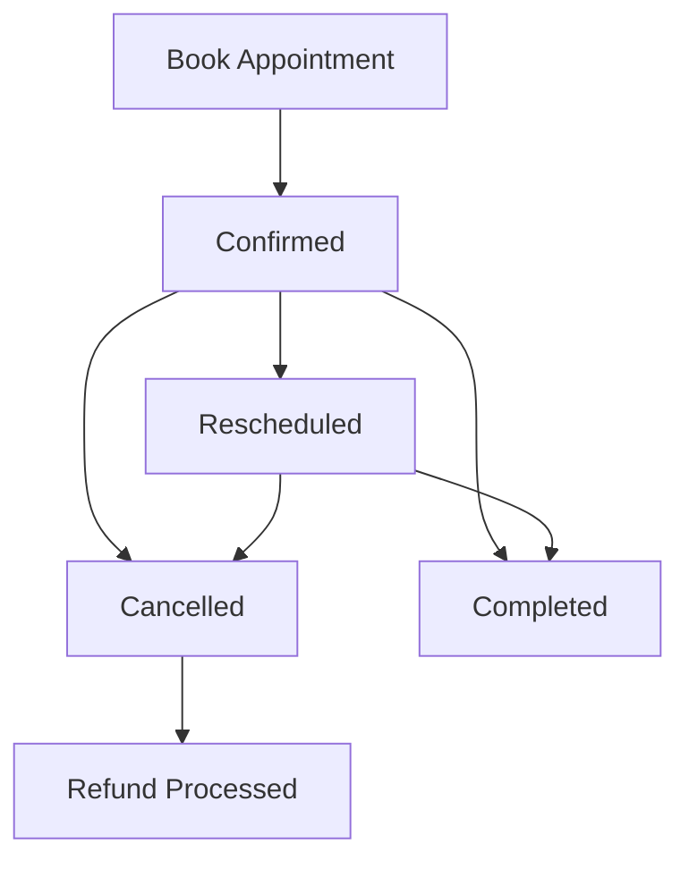

# Professional Appointment Booking and Payment Management System

A comprehensive blockchain-based appointment scheduling platform built on Stacks that facilitates secure booking, payment processing, and lifecycle management for professional services.

## Features

- **Secure Booking System**: Blockchain-based appointment scheduling with conflict-free time slot management
- **Automated Payment Processing**: Deposit handling with partial/full payment support
- **Flexible Scheduling**: Rescheduling and appointment modification capabilities
- **Intelligent Refund System**: Time-based refund calculations with configurable penalties
- **Service Management**: Multi-service support with custom pricing per provider
- **Comprehensive Lifecycle Management**: Complete appointment workflow from booking to completion

## System Architecture

### Core Components

1. **Appointment Records**: Central registry of all appointments with detailed metadata
2. **Provider Management**: Schedule tracking and availability checking
3. **Client Management**: Booking history and active appointment tracking
4. **Payment Processing**: Deposit handling and automated payment flows
5. **Service Configuration**: Flexible pricing and service type management

### Key Data Structures

- `appointment-records`: Main appointment data with status, timing, and payment info
- `provider-appointments`: Provider's schedule and appointment list
- `client-bookings`: Client's booking history and active appointments
- `service-rates`: Pricing structure by provider and service type

## Getting Started

### Prerequisites

- Stacks blockchain access
- STX tokens for transactions
- Clarity smart contract development environment

## Usage Guide

### For Service Providers

#### 1. Set Service Pricing
```clarity
(contract-call? .appointment-booking set-service-pricing "consultation" u1000000) ;; 1 STX
```

#### 2. Manage Appointments
```clarity
;; Mark appointment as complete
(contract-call? .appointment-booking mark-appointment-complete u1)

;; Cancel appointment
(contract-call? .appointment-booking cancel-appointment u1)

;; Process refund
(contract-call? .appointment-booking process-refund u1)
```

#### 3. Check Schedule
```clarity
;; View your appointments
(contract-call? .appointment-booking get-provider-schedule 'SP1234...)
```

### For Clients

#### 1. Book Appointment
```clarity
(contract-call? .appointment-booking book-appointment 
  'SP-PROVIDER-ADDRESS
  u1640995200 ;; Unix timestamp
  u60 ;; Duration in minutes
  "consultation")
```

#### 2. Complete Payment
```clarity
(contract-call? .appointment-booking complete-appointment-payment u1)
```

#### 3. Reschedule
```clarity
(contract-call? .appointment-booking reschedule-appointment u1 u1641081600)
```

#### 4. Modify Appointment
```clarity
(contract-call? .appointment-booking modify-appointment-details 
  u1 
  (some u90) ;; New duration
  (some "premium-consultation")) ;; New service type
```

## Configuration

### Business Logic Constants

- **Minimum Advance Notice**: 12 hours
- **Full Refund Deadline**: 24 hours before appointment
- **Partial Refund Percentage**: 50%
- **Deposit Percentage**: 50% of total fee
- **Maximum Appointments**: 100 per user

### Error Codes

| Code | Description |
|------|-------------|
| u100 | Unauthorized User |
| u101 | Invalid Appointment Time |
| u102 | Slot Not Available |
| u103 | Appointment Not Found |
| u104 | Invalid Status Transition |
| u105 | Duplicate Booking |
| u106 | Insufficient Funds |
| u107 | Refund Failed |
| u108 | Payment Failed |
| u109 | Deadline Expired |
| u110 | Invalid Price |
| u111 | Invalid Service Type |
| u112 | Invalid Appointment ID |

## Appointment Lifecycle



### Status Transitions

1. **Confirmed**: Initial state after successful booking
2. **Rescheduled**: Appointment time modified
3. **Cancelled**: Appointment cancelled by client or provider
4. **Completed**: Service delivered and marked complete
5. **Refund Processed**: Deposit refunded after cancellation

## Payment Flow

### Booking Process
1. Client books appointment
2. 50% deposit automatically transferred to provider
3. Appointment confirmed and recorded

### Completion Process
1. Provider marks appointment as complete
2. Remaining balance (50%) transferred from client to provider
3. Appointment status updated to "completed"

### Refund Process
1. Appointment must be cancelled first
2. Provider processes refund
3. Refund amount depends on timing:
   - **24+ hours before**: 100% refund
   - **Less than 24 hours**: 50% refund

## Security Features

- **Access Control**: Role-based permissions for providers and clients
- **Validation**: Comprehensive input validation and error handling
- **Conflict Prevention**: Automatic schedule conflict detection
- **Payment Security**: Secure STX transfers with failure handling
- **State Management**: Immutable appointment records with audit trail

## Read-Only Functions

### Get Appointment Details
```clarity
(get-appointment-information u1)
```

### Check Provider Availability
```clarity
(check-provider-schedule-availability 
  'SP-PROVIDER-ADDRESS 
  u1640995200 
  u60)
```

### Get Service Pricing
```clarity
(get-service-pricing 'SP-PROVIDER-ADDRESS "consultation")
```

### Get Booking History
```clarity
(get-client-booking-history 'SP-CLIENT-ADDRESS)
```

## Data Models

### Appointment Record
```clarity
{
  provider-address: principal,
  client-address: principal,
  appointment-timestamp: uint,
  duration-in-minutes: uint,
  current-status: string-ascii,
  service-type: string-ascii,
  total-fee: uint,
  deposit-paid: uint,
  payment-status: string-ascii
}
```

### Service Rate
```clarity
{
  provider-address: principal,
  service-type: string-ascii,
  price-in-microstx: uint
}
```